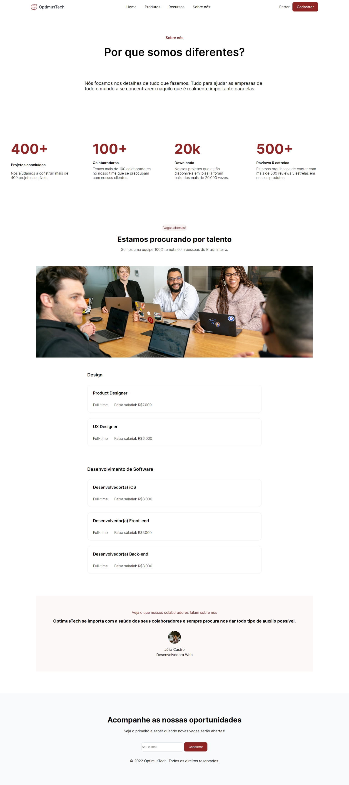

# 7DaysOfCode
<h1>Desafio de HTML e CSS da Alura</h1>

1º Dia - Desenvolvido o cabeçalho da página (Navbar)

2º Dia - Desenvolvido a primeira seção da página (cabeçalho)
 

3º Dia - Desenvolvido a seção de métricas da página
 

4º Dia - Desenvolvido a seção de procura de talentos

5º Dia - Desenvolvido a seção das vagas disponíveis

6º Dia - Desenvolvido a seção de depoimentos

7º Dia - Desenvolvido o footer da página

